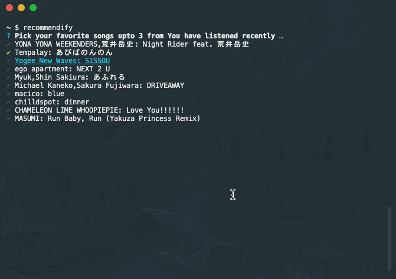
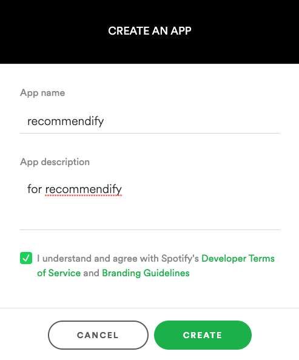
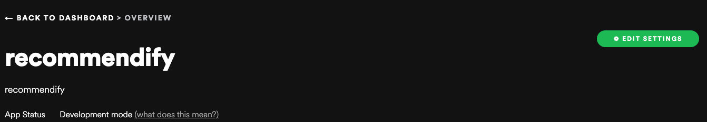
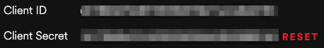
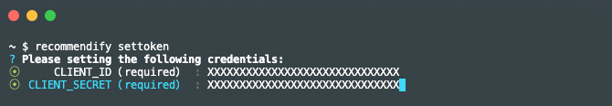

# recommendify

Create private playlist for your spotify account.

## install

```
% npm install -g recommendify

# Run only for the first time
% suggestify settoken
```

## Usage

```
Usage: index [options] [command]

Options:
  -h, --help      display help for command

Commands:
  createPlaylist  <Default> Create private playlist for your spotify account. Note:Require 'recommendify settoken' command before the first time you run.
  settoken        Login Spotify via authorization code flow (Refer: https://developer.spotify.com/documentation/general/guides/authorization-guide/).
  help [command]  display help for command
```



### How to set access token

1. Access and login your Spotify Dashboard: https://developer.spotify.com/dashboard/
2. Choose 'CREATE AN APP' and create your app.

3. Add Redirect URIs via 'EDIT SETTINGS': http://localhost:8888/callback

4. Copy your 'Client ID' and 'Client Secret' for the next step.

5. Run `recommendify settoken` and enter your credentials. You can retrive access token

