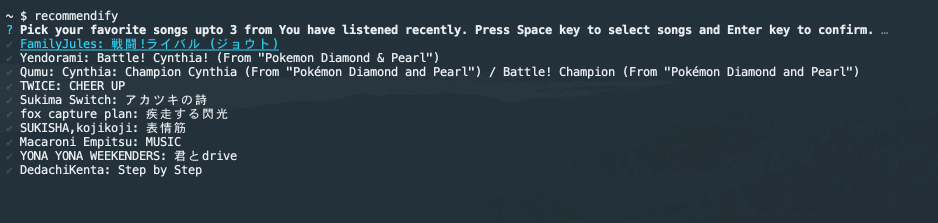

# recommendify

Answer the following 4 questions, and recommendify create a playlist matches your answers.

1. 1-3 songs from the songs you've listened to recently.
2. Positiveness of songs.
3. Popularity of artists.
4. BPM of songs.

## install

```
% npm install -g recommendify

# Run only for the first time
# Check 'How to set access token' in this document.
% recommendify settoken

% recommendify
```

## How to set access token

1. Access and login your Spotify Dashboard: https://developer.spotify.com/dashboard/
2. Choose 'CREATE AN APP' and create your app.

3. Add Redirect URIs via 'EDIT SETTINGS': http://localhost:8888/callback

4. Copy your 'Client ID' and 'Client Secret' for the next step.

5. Run `recommendify settoken` and enter your credentials. You can retrive access token


## Usage

```
Usage: recommendify [options] [command]

Options:
  -h, --help      display help for command

Commands:
  createPlaylist  <Default> Create private playlist for your spotify account. Note:Require 'recommendify settoken' command before the first time you run.
  settoken        Login Spotify via authorization code flow (Refer: https://developer.spotify.com/documentation/general/guides/authorization-guide/).
  help [command]  display help for command
```



